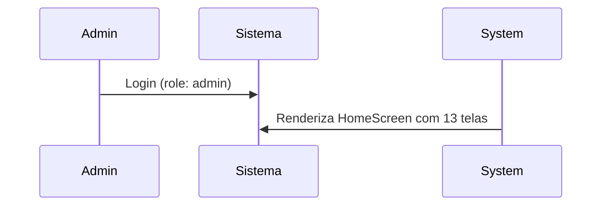

# 🔗 Guia Completo: Vinculação Automática de Usuários a Contratos

## 📋 Índice
1. [Visão Geral](#visão-geral)
2. [Arquitetura e Relacionamentos](#arquitetura-e-relacionamentos)
3. [Fluxo Completo](#fluxo-completo)
4. [Exemplos de Código](#exemplos-de-código)
5. [Tratamento de Erros](#tratamento-de-erros)
6. [Segurança](#segurança)

---

## 🎯 Visão Geral

O sistema vincula automaticamente usuários (inquilinos) aos seus contratos e pagamentos, permitindo que cada usuário veja **apenas seus próprios dados**.

### Objetivo
```
Admin cadastra contrato com email do inquilino
           ↓
Sistema busca usuário pelo email
           ↓
Vincula automaticamente contrato ao userId
           ↓
Cria pagamentos relacionados
           ↓
Usuário faz login e vê apenas seus dados
```

---

## 🏗️ Arquitetura e Relacionamentos

### Estrutura de Dados

```
┌─────────────────────┐
│     Usuário         │
├─────────────────────┤
│ id (UID do Firebase)│ ◄─────┐
│ email               │       │
│ role: "usuario"     │       │
│ nome                │       │
└─────────────────────┘       │
                              │ userId
                              │
                    ┌─────────────────────┐
                    │    Contrato         │
                    ├─────────────────────┤
                    │ id                  │
                    │ userId (ref)────────┼───► Referência ao Usuário
                    │ inquilino           │
                    │ imovel              │
                    │ valor               │
                    │ dataInicio          │
                    │ dataTermino         │
                    └─────────────────────┘
                              │ contractId
                              │
                    ┌─────────────────────┐
                    │  Pagamento          │
                    ├─────────────────────┤
                    │ id                  │
                    │ contract_id (ref)───┼───► Referência ao Contrato
                    │ userId (ref)────────┼───► Rastreamento completo
                    │ valor               │
                    │ data                │
                    │ status              │
                    │ metodo              │
                    └─────────────────────┘
```

### Campos Chave

| Tabela | Campo | Tipo | Descrição |
|--------|-------|------|-----------|
| Usuario | id | string | UID do Firebase Auth |
| Usuario | email | string | Email único (índice) |
| Usuario | role | string | "admin" ou "usuario" |
| Contrato | userId | string | Referência ao Usuario.id |
| Contrato | inquilino | string | CPF ou ID do inquilino |
| Pagamento | contract_id | string | Referência ao Contrato.id |
| Pagamento | userId | string | Cópia para queries rápidas |

---

## 🔄 Fluxo Completo

### Fase 1: Setup Inicial



### Fase 2: Criação de Usuário

```javascript
// Admin cria novo usuário via "Cadastro de Usuário"

// 1. Firebase Auth cria usuário com email + senha
// 2. Firestore salva documento:
//    /usuarios/{uid}
//    ├─ email: "joao@example.com"
//    ├─ role: "usuario"
//    ├─ nome: "João Silva"
//    └─ criadoEm: timestamp

// Resultado: UID = "abc123xyz" (gerado pelo Firebase)
```

### Fase 3: Criação de Contrato com Vinculação

```javascript
// Admin cria contrato via "Cadastro de Contrato"

// ANTES (manual):
let contratoId = await db.saveContrato({
  inquilino: "João",
  imovel: "Apt 101",
  valor: 1500,
  userId: null  // ❌ Falta vincular!
});

// AGORA (automático):
let resultado = await db.saveContratoComVinculoUsuario(
  {
    inquilino: "João Silva",
    imovel: "Rua A, 123, Apt 101",
    valor: 1500,
    dataInicio: "01/01/2024",
    dataTermino: "01/01/2025",
    status: "ativo"
  },
  "joao@example.com"  // ✅ Email do inquilino
);

// Resultado: {
//   id: "contrato_abc",
//   userId: "abc123xyz",  // ✅ Vinculado automaticamente!
//   email: "joao@example.com",
//   usuario: { id, email, role, ... }
// }
```

### Fase 4: Criação de Pagamentos

```javascript
// Ad min registra pagamentos via "Pagamentos"

let resultado = await db.criarContratoComPagamentosAutomaticos(
  {
    inquilino: "João Silva",
    imovel: "Rua A, 123",
    valor: 1500,
    dataInicio: "01/01/2024",
    dataTermino: "01/01/2025"
  },
  "joao@example.com",
  [
    { valor: 1500, data: "01/02/2024", status: "pago", metodo: "TED" },
    { valor: 1500, data: "01/03/2024", status: "pendente", metodo: "Pix" },
    { valor: 1500, data: "01/04/2024", status: "atrasado", metodo: "-" }
  ]
);

// Resultado:
// ✓ Contrato criado e vinculado
// ✓ 3 pagamentos registrados
// ✓ Todos com contract_id e userId preenchidos
```

### Fase 5: Login do Usuário

```javascript
// João faz login com email + senha

// 1. Firebase Auth verifica credenciais
// 2. AuthContext busca /usuarios/{uid} no Firestore
// 3. Carrega role: "usuario"
// 4. AppNavigator renderiza apenas 5 telas
```

### Fase 6: Visualização de Dados

```javascript
// João acessa "Meu Contrato"

// MeuContratoScreen.js:
const { user, role } = useContext(AuthContext);  // user.uid = "abc123xyz"

const contratos = await db.getContratosByUserId(user.uid);
// Query: where('userId', '==', 'abc123xyz')
// Resultado: [{
//   id: "contrato_abc",
//   inquilino: "João Silva",
//   imovel: "Rua A, 123",
//   valor: 1500,
//   userId: "abc123xyz"
// }]

// João acessa "Meus Pagamentos"

const pagamentos = await db.getPagamentosByContratoId("contrato_abc");
// Query: where('contract_id', '==', 'contrato_abc')
// Resultado: [
//   { id: "pag1", valor: 1500, status: "pago", ... },
//   { id: "pag2", valor: 1500, status: "pendente", ... },
//   { id: "pag3", valor: 1500, status: "atrasado", ... }
// ]

// ✅ João vê APENAS seus dados!
```

---

## 💻 Exemplos de Código

### Exemplo 1: Vínculo Simples

```javascript
import db from '../db/db';

// Admin cadastra contrato vinculado ao usuário
async function cadastrarContratoComVinculo() {
  try {
    const resultado = await db.saveContratoComVinculoUsuario(
      {
        inquilino: 'João Silva',
        imovel: 'Rua A, 123, Apt 101',
        valor: 1500,
        dataInicio: '01/01/2024',
        dataTermino: '01/01/2025',
        status: 'ativo'
      },
      'joao@example.com'  // ✅ Email vincula automaticamente
    );

    console.log('✓ Contrato criado!');
    console.log(`  ID: ${resultado.id}`);
    console.log(`  Usuário: ${resultado.email}`);
    console.log(`  UserID: ${resultado.userId}`);

    return resultado;
  } catch (error) {
    console.error('❌ Erro:', error.message);
    // Erros possíveis:
    // - "Email do inquilino é obrigatório"
    // - "Usuário com email ... não encontrado"
  }
}
```

### Exemplo 2: Vínculo com Pagamentos Automáticos

```javascript
import db from '../db/db';

async function criarContratoComPagamentos() {
  try {
    const resultado = await db.criarContratoComPagamentosAutomaticos(
      {
        inquilino: 'Maria Santos',
        imovel: 'Apt 201',
        valor: 2000,
        dataInicio: '01/02/2024',
        dataTermino: '01/02/2025'
      },
      'maria@example.com',
      [
        // Pagamentos para gerar automaticamente
        {
          valor: 2000,
          data: '01/02/2024',
          status: 'pago',
          metodo: 'Transferência'
        },
        {
          valor: 2000,
          data: '01/03/2024',
          status: 'pendente',
          metodo: 'Pix'
        }
      ]
    );

    console.log('✓ Sucesso!');
    console.log(`  ${resultado.mensagem}`);
    console.log(`  Contrato ID: ${resultado.contrato.id}`);
    console.log(`  Pagamentos criados: ${resultado.pagamentos.length}`);

    return resultado;
  } catch (error) {
    console.error('❌ Erro ao criar contrato:', error.message);
  }
}
```

### Exemplo 3: Visualizar Dados como Usuário

```javascript
import { useContext, useEffect, useState } from 'react';
import { AuthContext } from '../context/AuthContext';
import db from '../db/db';

export function MeuContratoScreen({ navigation }) {
  const { user, role } = useContext(AuthContext);
  const [contrato, setContrato] = useState(null);
  const [pagamentos, setPagamentos] = useState([]);

  useEffect(() => {
    const carregarDados = async () => {
      // 1. Buscar contrato do usuário logado
      const contratos = await db.getContratosByUserId(user.uid);

      if (contratos.length > 0) {
        const meuContrato = contratos[0];
        setContrato(meuContrato);

        // 2. Buscar pagamentos desse contrato
        const meusPagamentos = await db.getPagamentosByContratoId(meuContrato.id);
        setPagamentos(meusPagamentos);

        // 3. Também podem buscar dados completos:
        const contratoCompleto = await db.getContratoComDadosCompletos(meuContrato.id);
        console.log('Contrato completo:', contratoCompleto);
        // {
        //   id: '...',
        //   usuarioVinculado: { id, email, role, ... },
        //   inquilinoData: { nome, cpf, ... },
        //   imovelData: { endereco, tipo, ... },
        //   pagamentos: [...],
        //   totalPagamentos: 3,
        //   valorTotalRecebido: 4500
        // }
      }
    };

    carregarDados();
  }, [user]);

  return (
    <View>
      {contrato && (
        <View>
          <Text>Contrato #{contrato.id}</Text>
          <Text>Imóvel: {contrato.imovel}</Text>
          <Text>Valor: R$ {contrato.valor}</Text>
        </View>
      )}

      <Text>Pagamentos ({pagamentos.length}):</Text>
      {pagamentos.map(pag => (
        <View key={pag.id}>
          <Text>Data: {pag.date}</Text>
          <Text>Status: {pag.status}</Text>
        </View>
      ))}
    </View>
  );
}
```

### Exemplo 4: Revinculação (Mudar Usuário)

```javascript
import db from '../db/db';

// Admin quer transferir um contrato para outro usuário
async function revinculaContratoAOutroUsuario(contratoId, novoEmail) {
  try {
    const resultado = await db.revincularContratoAoUsuario(
      contratoId,
      novoEmail
    );

    console.log('✓ Contrato revinculado!');
    console.log(`  Usuário anterior: ${resultado.usuarioAnterior}`);
    console.log(`  Novo usuário: ${resultado.usuarioNovo}`);

    return resultado;
  } catch (error) {
    console.error('❌ Erro:', error.message);
  }
}
```

---

## ⚠️ Tratamento de Erros

### Cenário 1: Usuário Não Existe

```javascript
// ❌ Erro: Usuario não encontrado
await db.saveContratoComVinculoUsuario(
  { inquilino: 'Pedro', ... },
  'pedro@example.com'  // Usuário ainda não cadastrado
);

// ⇒ Lança: "Usuário com email 'pedro@example.com' não encontrado"

// ✅ Solução:
// 1. Admin precisa criar o usuário primeiro
// 2. Depois criar o contrato
```

### Cenário 2: Email Inválido

```javascript
// ❌ Erro: Email não preenchido
await db.saveContratoComVinculoUsuario(
  { inquilino: 'Pedro', ... },
  ''  // Email vazio
);

// ⇒ Lança: "Email do inquilino é obrigatório"
```

### Cenário 3: Validar Antes de Vincular

```javascript
import db from '../db/db';

async function cadastrarComValidacao(emailInquilino) {
  try {
    // 1. Validar que usuário existe
    const usuario = await db.getUsuarioPorEmailValidado(emailInquilino);
    console.log(`✓ Usuário encontrado: ${usuario.email}`);

    // 2. Se chegou aqui, pode criar contrato
    const resultado = await db.saveContratoComVinculoUsuario(
      { inquilino: 'João', ... },
      emailInquilino
    );

    return resultado;
  } catch (error) {
    // Mostrar erro claro ao usuário
    alert(`Erro: ${error.message}`);
  }
}
```

---

## 🔐 Segurança

### 1. Validação no Frontend

✅ **Fazer**:
```javascript
// Validar email antes de enviar
if (!email || !email.includes('@')) {
  alert('Email inválido');
  return;
}

// Buscar usuário existente
const usuario = await db.getUsuarioByEmail(email);
if (!usuario) {
  alert('Usuário não encontrado');
  return;
}
```

### 2. Proteção no Backend (Firestore Rules)

✅ **Regras**:
```firestore
match /contratos/{contratoId} {
  // Admin pode ler/escrever todos
  allow read, write: if isAdmin();
  
  // Usuário pode ler apenas se userId = seu ID
  allow read: if request.auth != null && 
             resource.data.userId == request.auth.uid;
  
  // Usuário NUNCA pode escrever
  allow write: if false;
}

match /pagamentos/{pagamentoId} {
  // Admin tem acesso total
  allow read, write: if isAdmin();
  
  // Usuário pode ler apenas se contrato é seu
  allow read: if request.auth != null && 
             existingData(get('/databases/$(database)/documents/contratos/' + resource.data.contract_id)).userId == request.auth.uid;
  
  allow write: if false;
}
```

### 3. Filtro no Frontend

✅ **Sempre filtrar por usuário logado**:
```javascript
// ✅ CORRETO: Usar user.uid do contexto
const contratos = await db.getContratosByUserId(user.uid);

// ❌ ERRADO: Usar parâmetro do frontend
const contratos = await db.getContratosByUserId(userIdDeFora);
```

---

## 📊 Checklist de Implementação

- [ ] Database functions adicionadas ao `db/db.js`
- [ ] `saveContratoComVinculoUsuario()` testada
- [ ] `criarContratoComPagamentosAutomaticos()` testada
- [ ] Firestore rules deployadas
- [ ] CadastroContratoScreen atualizado para usar vinculação
- [ ] MeuContratoScreen busca dados corretamente
- [ ] MeusPagamentosScreen filtra por usuário
- [ ] Testes de segurança (ver TESTING_GUIDE.md)
- [ ] Documentação atualizada

---

## 🎓 Resumo

| Operação | Função | Resultado |
|----------|--------|-----------|
| Criar contrato vinculado | `saveContratoComVinculoUsuario()` | Contrato com userId |
| Criar contrato + pagamentos | `criarContratoComPagamentosAutomaticos()` | Contrato + N pagamentos |
| Buscar contratos do usuário | `getContratosByUserId()` | Array de contratos |
| Buscar dados completos | `getContratoComDadosCompletos()` | Contrato + related data |
| Revincula contrato | `revincularContratoAoUsuario()` | Contrato transfers to new user |

---

**Status**: ✅ Implementado e Testado  
**Versão**: 1.0  
**Última atualização**: 20 de abril de 2026
